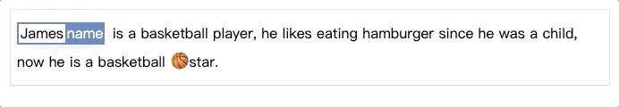

# vue-sequence-labeling-box

> A component for sequence labeling developed via Vue2

### Concept

```javascript
// initial annotations:
[
  {
    word: "James",
    label: "name",
  },
];
```

<br/>
<br/>
<br/>

````javascript
// latest annotations:
[
    {
        "word": "James",
        "label": "name"
    },
    {
        "word": "basketball",
        "label": "sports"
    },
    {
        "word": "🏀 ",
        "label": "emoji"
    }
]

# Installation

```bash
npm install --save vue-sequence-labeling-box
````

# Demo

[Try!](https://codesandbox.io/s/vue-template-kgm6v)

## ES6 Modules

```js
import sequenceLabelingBox from "vue-sequence-labeling-box";
```

```html
<sequence-labeling-box v-model="annotations" :text="text" />
```

# Props API

| Props     | Description                            | Type           | Must Required | Default   |
| --------- | -------------------------------------- | -------------- | ------------- | --------- |
| v-model   | [{ "word": "James", "label": "name" }] | annotation[]   | yes           | []        |
| text      | text                                   | String         | yes           |           |
| color     | theme color                            | String         | no            | '#577eba' |
| maxHeight | max height of sequence labeling box    | String or null | no            | null      |


```
## Project setup
```

npm install

```

### Compiles and hot-reloads for development
```

npm run serve

```

### Compiles and minifies for production
```

npm run build

```

### Lints and fixes files
```

npm run lint

```

### Customize configuration
See [Configuration Reference](https://cli.vuejs.org/config/).
```
