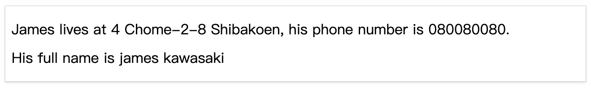
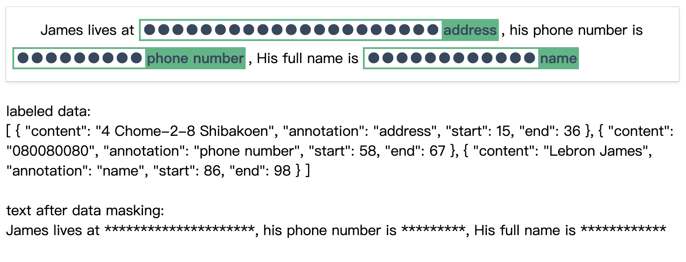

<br>

<p align="center">

</p>

<p align="center">
vue2-text-annotation
</p>

# Introduction
vue2-text-annotation is an easy-to-use component for text annotation and data masking. It achieves the features of locating, extracting and tagging entities in text. 

# Installation
```bash
npm install --save vue2-text-annotation
```

# 1. Text annotation

### Operation
1. Select or double click the content which you want to annotate, then an input dialog will pop up.
2. Enter content of annotation.
3. Click "ok" button or just press the enter key to annotate.
4. If you want to remove an annoation, hover on an annotation entity and click the delete button to remove.

### Demo


[Online preview](https://yt6cc.csb.app/)

[](https://codesandbox.io/s/vue2-text-annotation-yt6cc?file=/src/App.vue)

### Labeled data

```js
[
  {
    content: "Vue.js",
    annotation: "framework",
    start:0,
    end:6,
  },
  {
    content: "Evan You",
    annotation: "name",
    start:521,
    end:529,
  },
  {
    content: "JavaScript",
    annotation: "language",
    start:24,
    end:34,
  }
]
```
The labeled data generated by `vue2-text-annotation` can be used to build a data set of Natural Language Processing (NLP) model.

### Usage
```js
<template>
  <TextAnnotation
    v-model="textAnnotations"
    :text="text"
  />
</template>

<script>
import TextAnnotation from "vue2-text-annotation";

export default {
  components: {
    TextAnnotation,
  },
  data() {
    return {
      text: "Vue.js is a progressive JavaScript framework, which is used to build UIs (User Interfaces) and SPAs (Single-page Applications). This framework is famous for its fast-paced learning curve. It is such an easy to learn and approachable library that with the knowledge of HTML, CSS, and JavaScript, we can start building web applications in Vue.js. The fast learning curve is kind of a signature of this framework. It is a versatile framework for our need as a library or a full-fledged framework for building huge web apps.\nEvan You have created this framework. The idea of Evan You behind this framework is to build the best framework by combining the best features from already existing Angular and react Frameworks. Before building Vue.js, Evan You was working at Google. Inc and worked on Angular based projects. So, he came up with the idea of building his own framework. He picked the best parts of Angular, like template syntax, easy to use, and picked the best parts of React as well, like two-way data binding, the concept of props, component-based approach, and combined them to make a new framework Vue.js better than both of them.",
      textAnnotations: [{
        content: "Vue.js",
        annotation: "framework",
        start:0,
        end:6,
      }]
    }
  }
};
```

# 2. Data masking
Data masking is used to label and hide sensitive data, create new text that hides (masks) sensitive information. 

### Demo
Before data masking: <br/>
 <br/> <br/>
Data masking: <br/>
 <br/><br/>
After data masking: <br/>


[Online preview](https://x9gvs3.csb.app/)

[](https://codesandbox.io/s/data-masking-x9gvs3?file=/src/App.vue)

### Usage
```js
<template>
  <TextAnnotation
    v-model="textAnnotations"
    data-masking="true"
    :text="text"
    @afterDataMasking="updateTextAfterDataMasking"
  />
</template>

<script>
import TextAnnotation from "vue2-text-annotation";

export default {
  components: {
    TextAnnotation,
  },
  data() {
    return {
      textAnnotations: [],
      text:
        "James lives at 4 Chome-2-8 Shibakoen, his phone number is 080080080, His full name is Lebron James",
      textAfterDataMasking: "",
    };
  },
  methods: {
    updateTextAfterDataMasking(value) {
      this.textAfterDataMasking = value;
    },
  },
};
</script>
```


## Pops

| Property | Description | Type | Required | Default |
| -------- | ----------- | ---- | -------- | ------- |
| v-model | Bind to text annotations<br>e.g. <br>[{ content: "080080080", annotation: "phone number", start: 0, end: 5 }] | Annotation: <br>{<br>  content: string, <br>  annotation: string, <br>  start: number,<br>  end: number<br>} | true | [] |
| annotation-text-color | Font color of annotation entity | string | false |"#35495e" |
| annotation-bg-color | Background color of annotation entity | string | false | "#41b883"|
| data-masking | Set to `true` to start using data masking feature | boolean | false | false |
| data-masking-charactor | Charactor in data masking entity| string | false | '●' |
| maxHeight | Max height of data masking container | Number or Null | false | null | |
| replace-charactor | Charactor be used to replace the sensitive data | string | false | '*" |
| text | Text (Notice: please use `\n` in where you want to wrap a new line) | String | true | '' |


## Events
`afterDataMasking` event will be emitted when new sensitive data been masked. value of text after masking can be used inside of the callback function.

## Build Setup

```bash
# install dependencies
npm install
# serve with hot reload at localhost:8888
npm run serve
# build for production with minification
npm run build
```
